# Tame-Uppermill-FloodRisk  

## Analysis of Tame river Uppermill river level Gauge readings   

### Summery  

**Rate of change of river Tame level increasing, causing flood danger**

The rate of change of river level is increasing during high river events both at Uppermill and can be clearly seen at Mossley, where the river is deeper. The increase whilst rainfall has decreased shows the increasing flood risk and danger has nor been addressed by planning policies as directed by the Environment agency.

**Flood warnings and floods occur**

The long term river Tame level data shows the Tame has flood risk levels on a consistent basis. The flood levels were set to indicate danger.  

**Recent flood happened very fast**

The daily chart for 17/3/2019 shows the problem with speed of run off, with the steepness of the increase in level. Further work is required to quantify and ameliorate that risk.  

Raw data from the Tame may be examined, (once it is released) to measure any increase in rate of level increase.  

**Rainfall does not account for changes in level and rate of change**

It may also be possible to extract more information from the daily data by cross referencing daily rainfall data, which may show higher levels for the same rain fall.  

The long term analysis of North west rainfall shows there is a significant risk of greater levels of rain in the past, in the 1930s and 1940s there could be 5 >150 mm per month, rainfall events per year.  This shows flooding incidence are currently low and flooding events of greater magnitude are inevitable.  

**Spurious? flood event 2013, not counted in analysis**

The "spurious" massive event between the 16th and 18th March 2013 - where flood levels were measure at >3000 cm appears to be a real event with real very high levels of flooding. Whist the gauge may have over estimated the level, it appears well above previous highs down stream at Wagon gauge at Mossley with 70 cm above the flood level.  

The river authority need to explain what caused the error, if there was one and what flood level happened, as it is the largest event seen while monitoring has taken place..  

Because this is a real event, the Flood risk situation at Uppermill and Mossley is worse than previously reported i.e. inevitable, just a matter of time.  

**Over development of Saddleowrth, not being addressed**

#### Planner should be taking action as designated by the Environment Agency report [Ref6]  

*Quote 11. Flood risk is increasing, perhaps substantially, so Planners, Emergency Planners, Asset Managers and others will need to mitigate this  through a mix of collaborative working, planning policies, use of ‘worst case’ scenarios,development of contingency plans, and some detailed analysis.*

Wheras, [Ref9] (Saddleworth Long term Traffic analysis) shows there has been a significant increase in traffic and therefore development,  over the monitoring period.

### Method  

Gauge data for Uppermill Tame river was obtained from :   [Ref1] : riverlevels.uk  

This data contains an average level for the day and a maximum and minimum level for the day.  

The Flood data for 17/3/2019 raw data was obtained Government flood warning information service. [Ref2]  

The river level data was inspected and a number of incorrect gauge readings were deleted. These were identified by the number 99.9999 and were understood to be when the gauge had failed.

The Uppermill river gauge data was input into a spreadsheet and various charts were  produced to show various aspects of the river level data, see results and spreadsheet charts tab.  

Rain data from [Ref3] was analysed and compared with river and flood levels.  

### Observations :

**Flood events already occur regularly**

The maximum river level shows there are numerous flood level event already a year. These flood levels are consistently much higher than the preceding level, i.e. are of a semi flash flood type. There is a close relation to the rain and river level, i.e. little buffer or soak to the rain fall.  

**Flood levels are increasing**

The level of floods has increased (apart from one outlier flood in 2013), despite lower rainfalls ....   

**Rainfall has been a lot worse historically** 

The long term charts shows the significant numbers of flood conditions of the Tame. There have been 5 days when levels over 89cm in 8 years.  

**A high flood warning conditions are still occurring**

The recent flood condition of the 17/3/2019 was the latest.  

**Flood level trend is to be higher**

The maximum level chart shows that the frequency of floods is current low. However, the level of floods is consistent high.  

**Flood level trend is to be quicker**

Analysis of the number of flood conditions shows the river level is generally low, then shoots up metres during a flood. Again indicating increased run off speed.  

The data analysed is from daily averages of the raw data - it underestimates the rate of change. This chart shows the raw change for one day. The raw data should be made available at some stage.  [Ref1].  

The Daily level chart for 20th March 2019 shows near vertical increase in river level. This flood was observed to occur during the period it was raining. This shows the current level of "soak" is deficient, since the river went increase from 0.2 Metres to nearly 1 metre in a few hours. Then subsided after the rain stopped.  

**Observations on inconsistent rain and river level anomalies**

If the reduction in river level change per day could be less rain or the effect of drains, or drought.  

1. These do not ameliorate  the speed of build up of water and maximum flood height.  
2. If these drains fail due to blockage , it is liable to quickly cause disastrous flood heights as any increase would be.  

see [Ref4] and [Ref11] where floods were caused by blocked drains.  

3. If drought is the cause then if rainfall levels returned to normal there would be more floods.  

The Analysis of North West rainfall per month from 2012 to 2019 also shows that the normal level of rain is 100 mm per Month and an increase to 150 to 200 mm per Month can cause flooding conditions. This shows once more a disproportional flooding response from relatively minor, or at least usual, variations in rain fall.  

**Rate of River Level change is increasing**

The rate of river level charts for Uppermill show a visible increase in level. However , the daily chart underestimates the actual real time flow, due to the quicker flow than (say) lower down stream at Mossley. It does show an increase when the lower rainfall is taken into account.

The rate of river level charts change charts for Uppermill and Mossley [Ref5] shows generally an increase in level of rate of flood increase over the period 2012 - 2019, consistent with loss of soak.  

This chart shows the Rate of change above 200 (cm/d/m) more clearly. Again the recent flood would be more significant on higher resolution samples.

Whilst not as obvious as the velocity change, similarly, the normalised acceleration of the river level change shows a general increase in level of 10% - 20%, from 2012 to 2019 and an increased frequency of high rates of change of level rate of change.  This can be clearly see if one counts the incidence above 150 (cm/d/d), ignoring the 2013 levels.

Again, this combined with the low to normal rainfall, indicates a deteriorating "soak" condition, or increased  "run off" speeds, feeding the river being the difference and cause of increased frequency and height of river level acceleration.

#### Tame Uppermill river, Rate of level change > 200cm/d/m.    

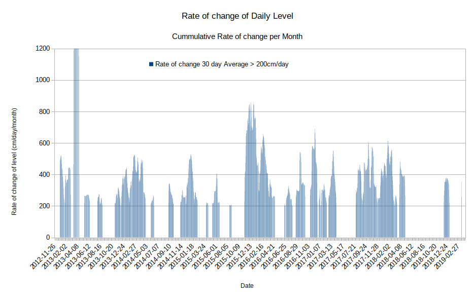  

#### Tame river Uppermill, Rate of level change > 400cm/d/m.    

  

#### Tame Uppermill river, Accleration  of river level change.    

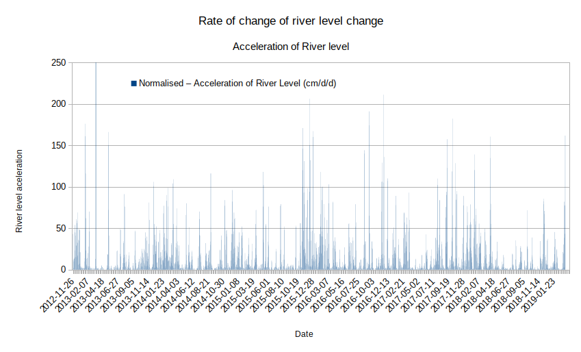  

#### Tame river Uppermill, Real time change in level during 17/3/2019 flood level incident.  

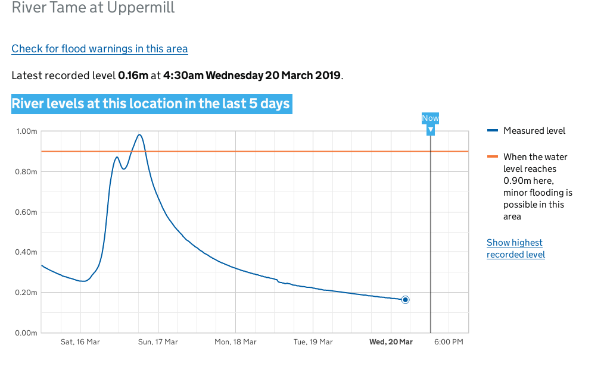  

#### Tame River  Uppermill - Number of days at each level  2012 - 2019  

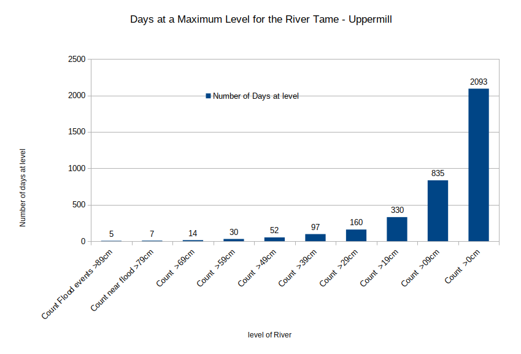  

#### Tame River Uppermill - Rate of change of level  

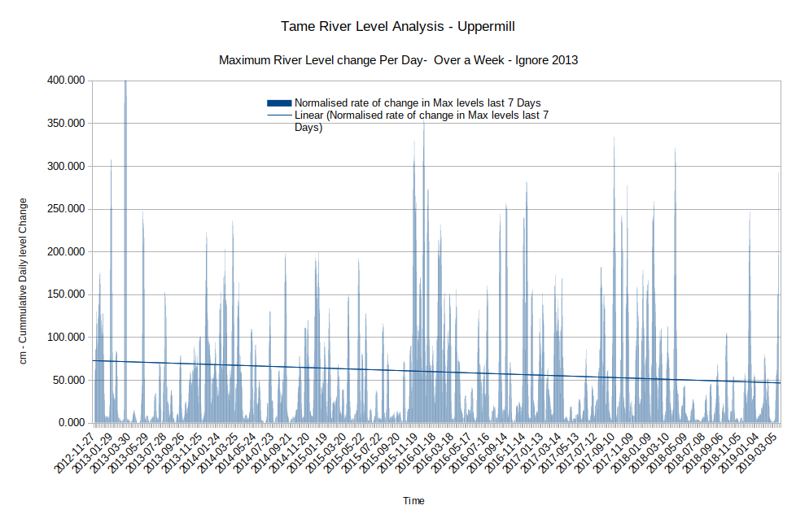  

### Conclusions :

**Maximum river events are recent / increasing**

It is very concerned to observe that most of the new "Maximum river level recorded events" have happened since December 2015.  

From 2012 - 2016 there was only 1 highest river level recorded event at Uppermill.  

From 2016 there are 8 events above that level, 3 being highest recorded levels.  

The recent flood level of the Tame at Uppermill - March 2019 occurred with ~75mm of rain per month. In the recent past rain levels for Oldham have been >350mm per Month. Viewing the chart of the recent flood it is apparent that any continuation of the rain on that day would have caused a substantial flood, with higher levels than 1m (0.9m warning).

It was only through abnormal luck and weather that the recent flood levels of the Tame at Uppermill  March 2019 did not result serious flooding.

This proves beyond all doubt that less water is causing the same floods height levels.  This is an analysis of the Average level - not the Maximum level. This indicates the reduction in soak of the river Tame is causing an increased risk and severity of floods.  

**Climate change does not account for river changes**

Climate change should have reduced the level of floods, but hasn't. However, it, or variations in weather patterns, do change the frequency of floods.  

The height of floods is historically high, whilst rainfall and level are historically normal to low.  

### Further work :  

**Monitor raw data, not daily**

Raw data from the Tame may be examined, once it is released, to measure any increase in rate of level increase.  

**Cross reference real time rain / rate of rain fall**

It may also be possible to extract more information from the daily data by cross referencing daily rainfall data, which may show higher levels for the same rain fall as a result of rain fall "soak" reduction and other developments.  

**Cross reference river levels to building  developments**

Data could also be cross related to historical developments levels in the area, however requests for development data showed that is not made available..  

### Results and charts :  

This chart shows the maximum river levels per day.  

#### Tame Maximum Levels per day, 90cm = Flood risk   

  

#### Tame Change in Average river Levels per day.  

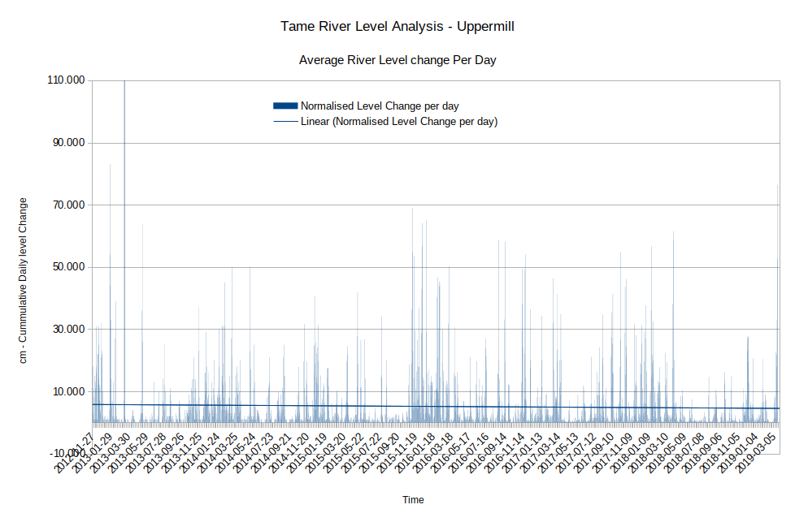  

#### Tame Change in Average river Levels per day, over 7 Days.  

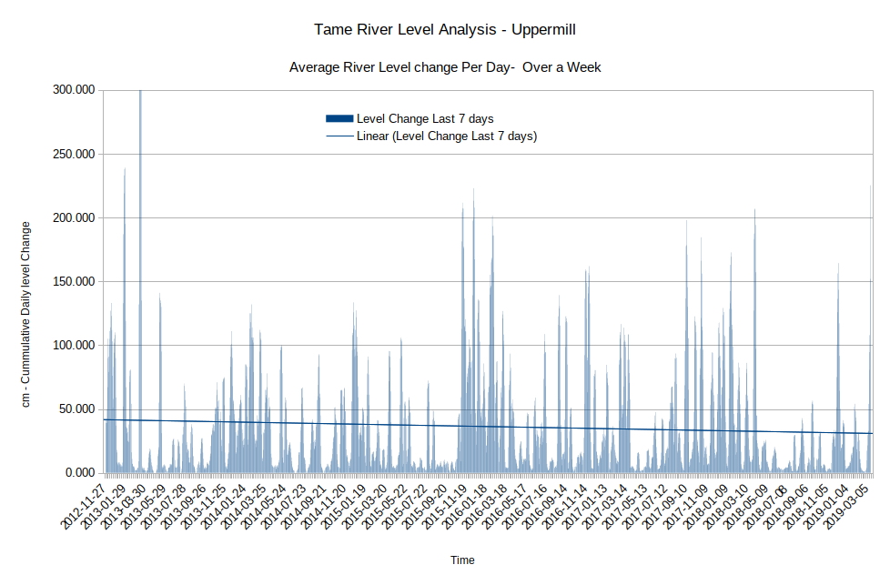  

#### Tame Change in Average river Levels per day, over 30 Days.  

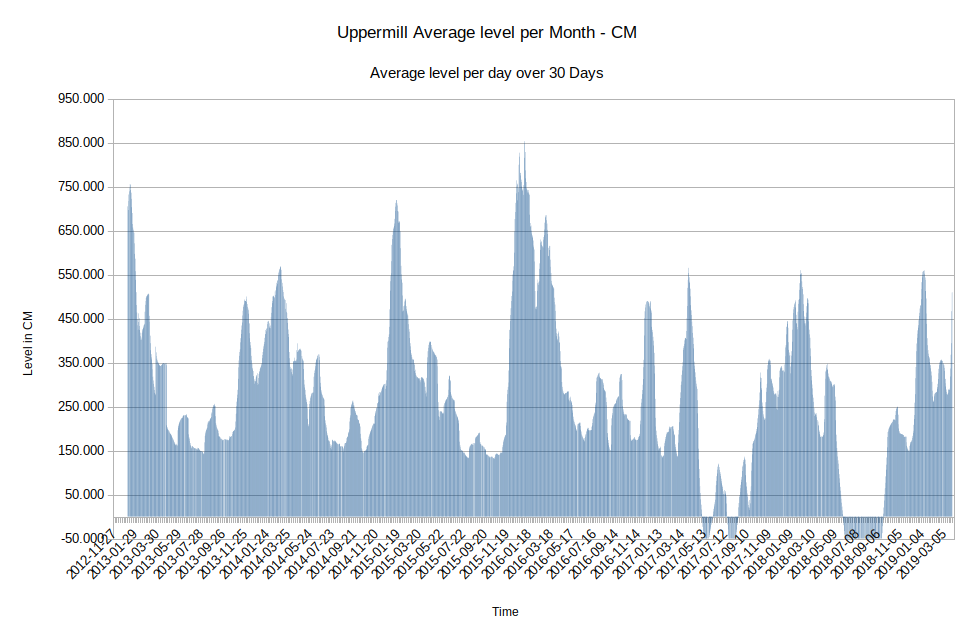  

#### Tame Change in Average river Levels per day, over 300 Days.  

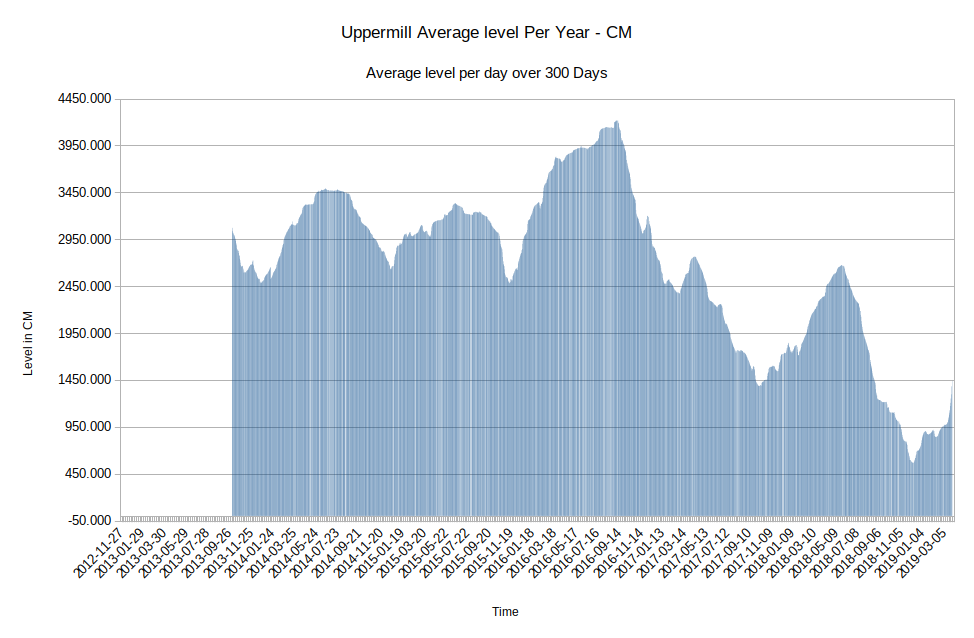  

#### North West England Rainfall level (mm) per Month.   

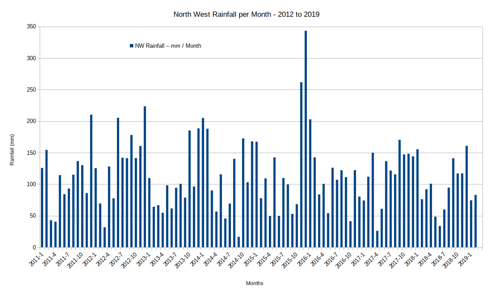  

#### Number of Months in North West England with rainfall over 200 mm per Month from 1910 - 2019.  

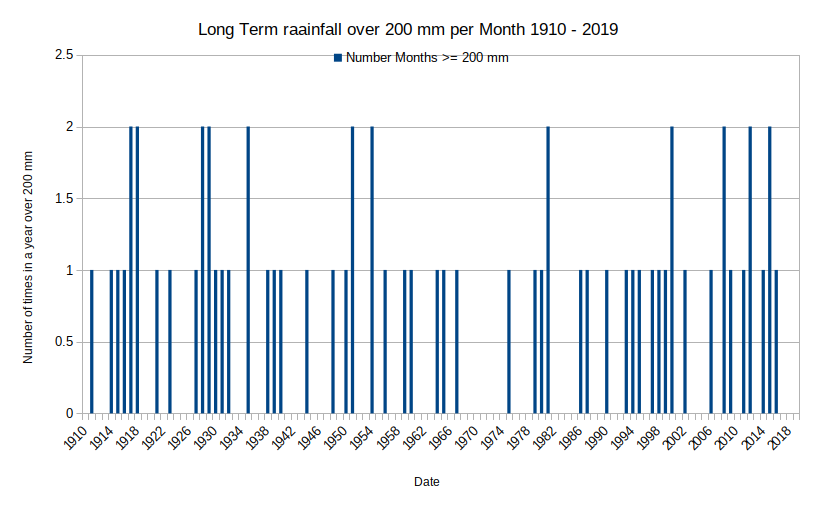   

#### Number of Months in North West England  with rainfall over 150 mm per Month from 1910 - 2019.    

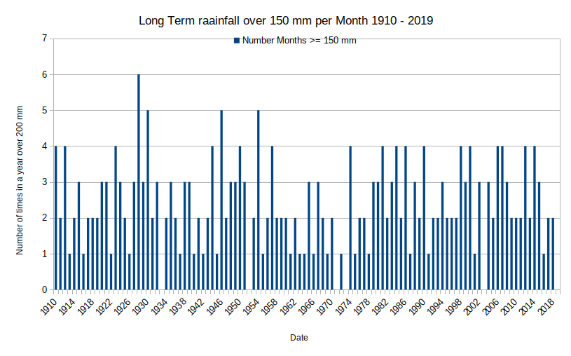  

#### [Ref10] Gaugemap March 2019 - Tame Flood levels / Month.      

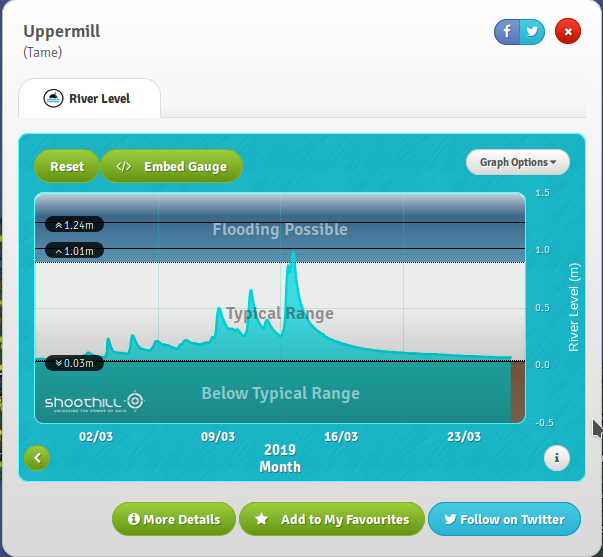  

### Flood images

#### River Tame at Uppermill getting very high 2012. Picture: Stuart Littleford.

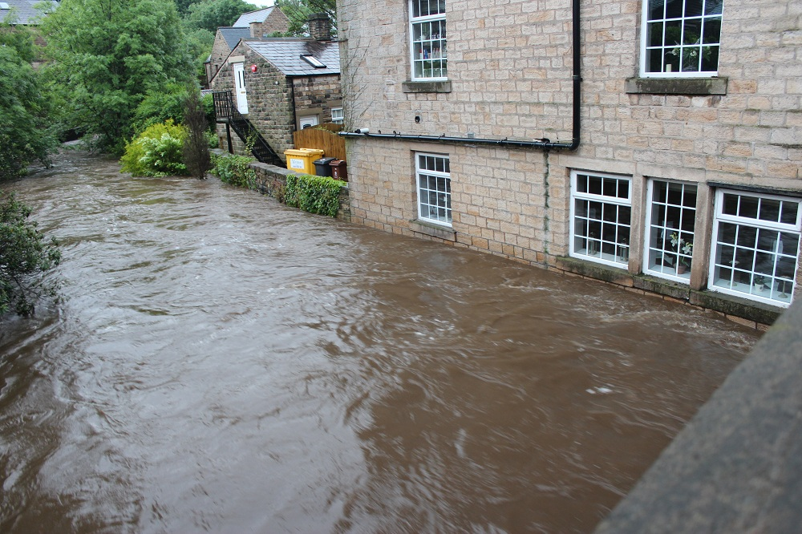 

#### River Tame at Proposed Diggle school site 2015. 

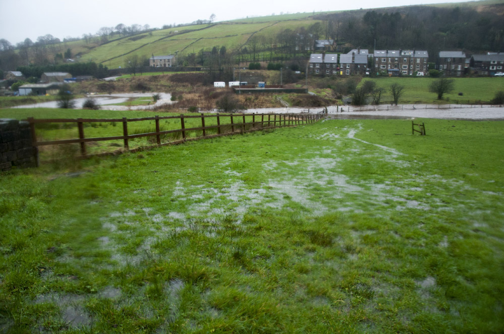 

#### River Tame at between  Diggle and Mossley flooded 2012. Picture: Stuart Littleford.

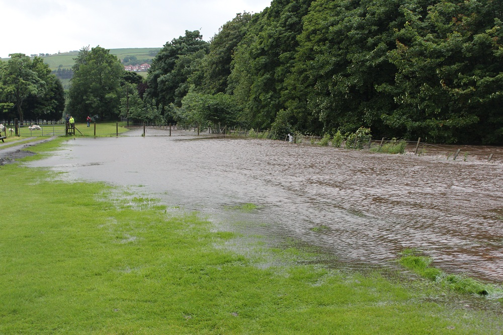 

#### Flood at Dobcross [Ref11] blocked drains

 

#### Flood at Dobcross [Ref11] blocked drains

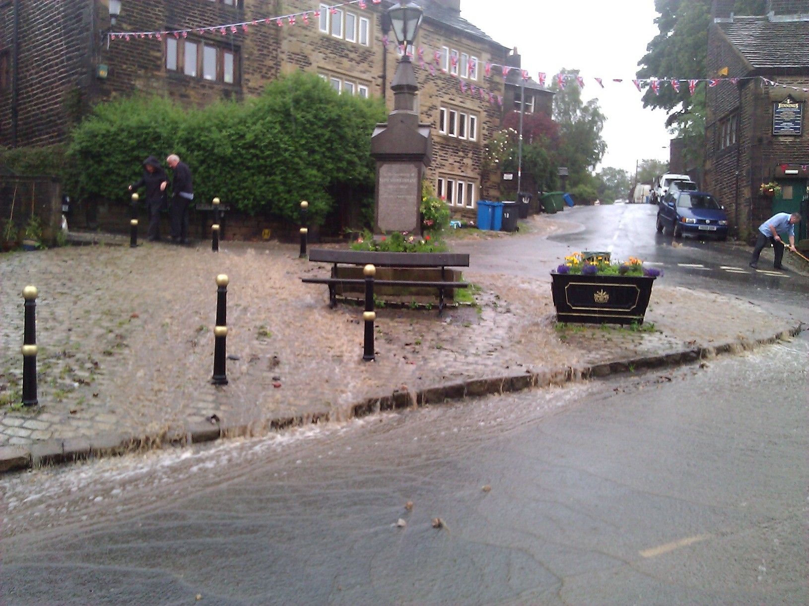 

#### Flood at Delph flood + blocked drains

 

### References

[Ref1] : https://flood-warning-information.service.gov.uk/station/5143  
[Ref2] : https://riverlevels.uk/tame-saddleworth-uppermill#.XJImV4WnyV5  
[Ref3] : https://www.metoffice.gov.uk/climate/uk/summaries/datasets#yearOrdered  
[Ref4] : http://www.saddleworthlife.com/dobcross-pub-flooded-due-to-blocked-drains/  
[Ref5] : Mossley Flood Risk : https://github.com/wrapperband/Tame-Mossley-FloodRisk  
[Ref6] North West river basin district Flood Risk Management Plan 2015 to 2021 : https://assets.publishing.service.gov.uk/government/uploads/system/uploads/attachment_data/file/507122/LIT_10210_NORTH_WEST_FRMP_PART_B.pdf  
[Ref7] : Open Condition Monitoring : https://github.com/wrapperband/Open-Condition-Monitoring  
[Ref8] : Maintenance Allocation Practices and Techniques : https://wrapperband.github.io/Open-Condition-Monitoring/MaintenanceTechniquesAnalysis/  
[Ref9] : Saddleworth traffic increase case study : https://github.com/wrapperband/OpenTrafficSurvey/tree/master/CaseStudies  
[Ref10] : Gauge map of Uppermill : https://www.gaugemap.co.uk/#!Map/Summary/546/554  
[Ref11] : Flood in Dobcross : http://www.saddleworthlife.com/dobcross-pub-flooded-due-to-blocked-drains/  
[Ref12] : Flooding in Uppermill : https://www.youtube.com/watch?v=jCPIq5jEIDQ  
[Ref13] : Flooding in Greenfield : https://www.youtube.com/watch?v=atjfpxU_AU8  
