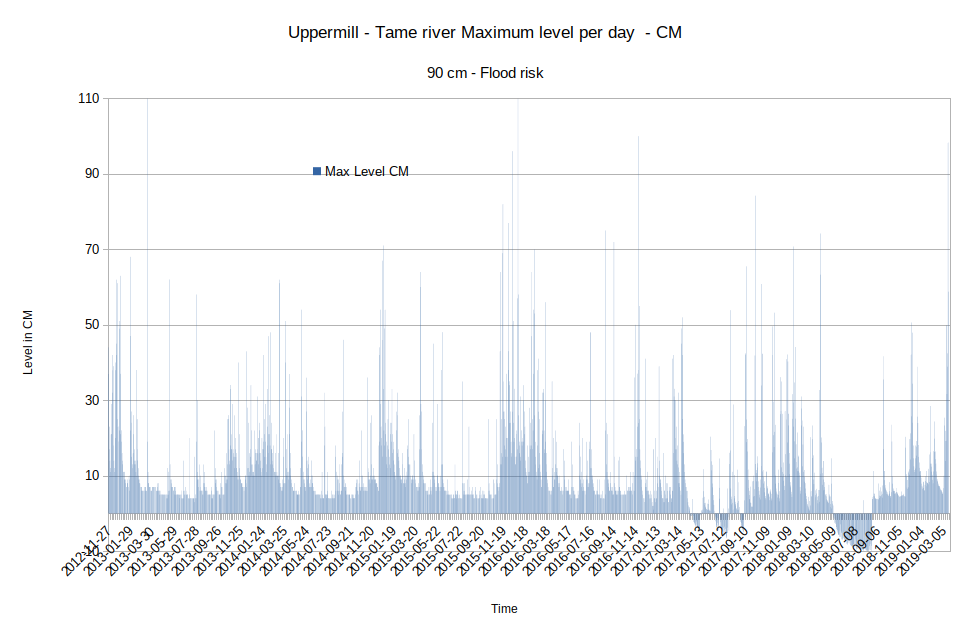
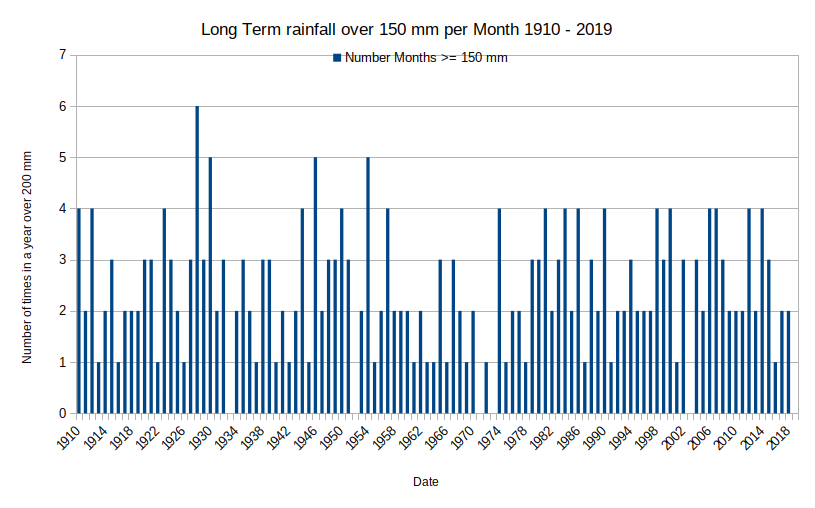

# Tame-Uppermill-FloodRisk  

## Analysis of Tame river Uppermill river level Gauge readings  

### Summery

The long term river Tame level data shows the Tame has flood risk levels on a consistent basis. The flood levels were set to indicate danger.

The daily chart for 17/3/2019 shows the problem with speed of run off, with the steepness of the increase in level. Further work is required to quantify and ameliorate that risk.

Raw data from the Tame may be examined, (once it is released) to measure any increase in rate of level increase. 

It may also be possible to extract more information from the daily data by cross referencing daily rainfall data, which may show higher levels for the same rain fall.

The long term analysis of North west rainfall shows there is a significant risk of greater levels of rain in the past, in the 1930s and 1940s there could be 5 >150 mm per month, rainfall events per year.  This shows flooding incidence are currently low and flooding events of greater magnitude are inevitable.

### Method

Gauge data for Uppermill Tame river was obtained from :   [Ref1] : riverlevels.uk

This data contains an average level for the day and a maximum and minimum level for the day.  

The Flood data for 17/3/2019 raw data was obtained Government flood warning information service. [Ref2]

The data was input into a spreadsheet and various charts were  produced to show various aspects of the river level data, see results and spreadsheet charts tab.

Rain data from [Ref3] was analysed and compared with flood levels.

### Observations :

The maximum river level shows there are numerous flood level event already a year. These flood levels are consistently much higher than the preceding level, i.e. are of a semi flash flood type. There is a close relation to the rain and river level, i.e. little buffer or soak to the rain fall. 

Analysis shows the change in river level per day has slightly decreased since 2012.  Yet, the level of floods has increased (apart from one outlier flood in 2013) ....   

The long term charts shows the significant numbers of flood conditions of the Tame. There have been 5 days when levels over 89cm in 8 years.

The recent flood condition of the 17/3/2019 was the latest. 

The maximum level chart shows that the frequency of floods is current low. However, the level of floods is consistent high.

Analysis of the number of flood conditions shows the river level is generally low, then shoots up metres during a flood. Again indecating increased run off speed.

The data analysed is from daily averages of the raw data - it underestimates the rate of change. This chart shows the raw change for one day. The raw data should be made available at some stage.  [Ref1].

The Daily level chart for 20th March 2019 shows near vertical increase in river level. This flood was observed to occur during the period it was raining. This shows the current level of "soak" is deficient, since the river went increase from 0.2 Metres to nearly 1 metre in a few hours. Then subsided after the rain stopped.

If the reduction in river level change per day could be less rain or the effect of drains, or drought.

1. These do not ameliorate  the speed of build up of water and maximum flood height
2. If these drains fail due to blockage , it is liable to quickly cause disastrous flood heights as any increase would be.
3. If drought is the cause then if rainfall levels returned to normal there would be more floods.

The Analysis of North West rainfall per month from 2012 to 2019 also shows that the normal level of rain is 100 mm per Month and an increase to 150 to 200 mm per Month can cause flooding conditions. This shows once more a disproportional flooding response from relatively minor, or at least usual, variations in rain fall.

#### Tame river, change in level during 17/3/2019 flood level incident

  

#### Tame River - Number of days at each level  2012 - 2019

  

### Conclusions :

This proves beyond all doubt that less water is causing the same floods height levels.  This is an analysis of the Average level - not the Maximum level. This indicates the reduction in soak of the river Tame is causing an increased risk and severity of floods.

Climate change should have reduced the level of floods, but hasn't. However, it, or variations in weather patterns, do change the frequency of floods. 

### Further work : 

Raw data from the Tame may be examined, once it is released, to measure any increase in rate of level increase. 

It may also be possible to extract more information from the daily data by cross referencing daily rainfall data, which may show higher levels for the same rain fall as a result of rain fall "soak" reduction and other developments.

In particular, it would be advantageous to count historic rainfall values of over 150 mm to further estimate the flood risk.

Data could also be cross related to developments, however requests for development data showed that is not made available..

### Results and charts :

This chart shows the maximum river levels per day.  

#### Tame Maximum Levels per day, 90cm = Flood risk  

  

#### Tame Change in Average river Levels per day.  

  

#### Tame Change in Average river Levels per day, over 7 Days.  

  

#### Tame Change in Average river Levels per day, over 30 Days.  

  

#### Tame Change in Average river Levels per day, over 300 Days.  

  

#### North West England Rainfall (mm) per Month.  

#### Number of rainfall events over 200 mm per Month 1910 - 2019.  

#### Number of rainfall events over 150 mm per Month 1910 - 2019.  

[Ref1] : https://flood-warning-information.service.gov.uk/station/5143  
[Ref2] : https://riverlevels.uk/tame-saddleworth-uppermill#.XJImV4WnyV5  
[Ref3] : https://www.metoffice.gov.uk/climate/uk/summaries/datasets#yearOrdered
